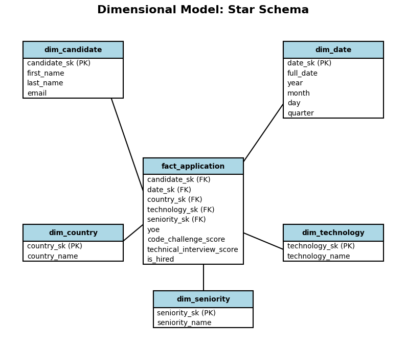

# Workshop 1: Dimensional Data Warehouse for Technical Recruitment

## Project Objective
The objective of this project is to build an analytical data system that satisfies business requirements for a technology recruitment company. This involves translating business needs into data requirements, designing a Dimensional Data Model, implementing an ETL pipeline, and generating analytical outputs.

## Business Context
A technology recruitment company wants to improve its understanding of its candidate selection processes. The company receives thousands of applications from candidates with different professional backgrounds, levels of experience, countries, seniority levels, and technology profiles.

Candidate performance is evaluated using a Code Challenge and a Technical Interview. A candidate is considered **HIRED** when their Code Challenge Score ≥ 7 AND Technical Interview Score ≥ 7.

## Five Business Requirements
- **R1 - Hiring Trends:** Monitor hiring trends over time to identify changes in recruitment outcomes.
- **R2 - Technology Analysis:** Compare hiring results across technologies to identify which technical profiles generate the largest number and proportion of hired candidates.
- **R3 - Candidate Profile Analysis:** Analyze hiring outcomes according to candidate seniority and years of professional experience.
- **R4 - Geographic Recruitment Analysis:** Identify countries with the highest recruitment activity and compare their hiring outcomes to support geographic recruitment strategies.
- **R5 - Assessment Performance Analysis:** Analyze the relationship between Code Challenge Scores and Technical Interview Scores by Seniority to identify potential gaps in technical expectations.

## Requirements Traceability

| Requirement | Business Question | Data Required | Expected Analytical Output |
| :--- | :--- | :--- | :--- |
| **R1** | How do hiring volumes and rates change over months/years? | Application Date, Code Score, Tech Score | Line chart / KPI of monthly applications and hires |
| **R2** | Which technologies yield the best hiring rates? | Technology, Code Score, Tech Score | Bar chart comparing total applicants vs hires per tech |
| **R3** | Do senior candidates have a higher hiring rate? | Seniority, YOE, Code Score, Tech Score | Table showing hiring rate and average YOE per seniority |
| **R4** | Which countries provide the most hired candidates? | Country, Code Score, Tech Score | Map/Bar chart showing top countries by volume and hires |
| **R5** | Are there discrepancies in test performance based on seniority? | Seniority, Code Score, Tech Score | Comparison of average scores in both tests per seniority |

## Dataset Description
The source dataset contains approximately 50,000 candidate applications (each row represents one application).
Attributes:
- First Name, Last Name, Email
- Country, Application Date
- YOE (Years of Experience), Seniority, Technology
- Code Challenge Score, Technical Interview Score

## Main Profiling Findings
- 50,000 records, 10 columns.
- No missing (null) values in any column.
- No duplicate records.
- YOE ranges from 0 to 30 (mean: 15.3).
- Both Code Challenge and Technical Interview scores range from 0 to 10.

## Business Process
The business process being analyzed is the **Candidate Application and Evaluation Process**. We want to understand the outcomes (hired or not hired) based on candidates' profiles and technical assessments.

## Grain Definition
One row in the Fact Table represents **one candidate application**.

## Star Schema Diagram


## Explanation of Dimensions and Facts
- **FactApplication:** Contains the measures (Code Challenge Score, Technical Interview Score, YOE) and the derived measure (`is_hired`). It references all dimensions via surrogate keys.
- **DimCandidate:** Stores unique candidate details (`first_name`, `last_name`, `email`).
- **DimDate:** Provides a detailed temporal context (`year`, `month`, `day`, `quarter`) extracted from the Application Date.
- **DimCountry:** Provides geographic context.
- **DimTechnology:** Stores the technology profiles.
- **DimSeniority:** Stores candidate seniority levels.

## ETL Architecture
1. **Extract (`src/extract.py`):** Reads the raw CSV file using pandas.
2. **Transform (`src/transform.py`):** Cleans data, normalizes column names, and applies the `is_hired` business rule.
3. **Dimensional Transformation (`src/dimensional_model.py`):** Extracts unique records for dimensions, generates surrogate keys (`_sk`), and maps them back into a Fact table format.
4. **Load (`src/load.py`):** Loads the Pandas DataFrames into a SQLite database (`database/recruitment_dw.db`).

## Main Transformation Decisions
- Generated the `is_hired` column (1 for Hired, 0 for Not Hired) based on the business rule: `(Code Score >= 7) AND (Tech Score >= 7)`.
- Used Pandas to extract unique dimensional records and assigned incremental surrogate keys (`index + 1`).
- Mapped the raw text values in the Fact table to their respective surrogate keys via table joins (`merge`).

## Technologies
- **Python** (Pandas, SQLite3, Matplotlib for diagrams)
- **SQL** (SQLite dialect)
- **Jupyter Notebook** (Data profiling)

## Instructions to Run the Project
1. Install requirements:
   ```bash
   pip install -r requirements.txt
   ```
2. Run the ETL Pipeline (this will extract, transform, build dimensions, and load into SQLite):
   ```bash
   python src/main.py
   ```
3. Generate the Schema Diagram (if not already present):
   ```bash
   python temp_draw.py
   ```
4. Query the Database: Use any SQLite client (e.g., DBeaver, sqlite3 CLI) to connect to `database/recruitment_dw.db` and execute the queries found in `sql/analytical_queries.sql`.

## Analytical Queries and KPIs
All analytical queries are available in `sql/analytical_queries.sql`. They address:
- Monthly hiring rates (R1)
- Hiring performance by Technology (R2)
- Average YOE and Hire Rate by Seniority (R3)
- Top 10 Countries by applicant volume (R4)
- Average assessment scores by Seniority (R5)

## Main Business Findings
- The `is_hired` metric provides a sharp contrast between applicants, showing exactly which cohorts pass the strict `Code Score >= 7 AND Tech Score >= 7` barrier.
- Grouping by Seniority and Technology enables recruiters to identify which sources (Countries, Tech stacks) yield the best conversion rates, allowing them to optimize their hiring pipeline.

## Final Requirements Validation

| Requirement | Implemented? | DW Tables Used | Query / KPI | Main Finding |
| :--- | :--- | :--- | :--- | :--- |
| R1 | Yes | fact_application, dim_date | Monthly hiring trends | Enables temporal trend analysis. |
| R2 | Yes | fact_application, dim_tech | Hiring performance by tech | Identifies best performing tech profiles. |
| R3 | Yes | fact_application, dim_seniority | Hire rate by seniority | Compares outcomes across experience levels. |
| R4 | Yes | fact_application, dim_country | Top 10 countries | Highlights key geographic markets. |
| R5 | Yes | fact_application, dim_seniority | Score averages by seniority | Checks for test discrepancies by seniority. |

- **Does the final Data Warehouse provide enough information to satisfy all five business requirements?** Yes, the grain is fine enough and dimensions contain all necessary context.
- **Does the dimensional model contain elements that are not justified by the analytical requirements?** No, every dimension was specifically created to support at least one of the requirements.
- **What business decisions can now be supported?** Targeting specific countries for recruitment, adjusting tech-stack specific outreach, and revising test difficulty for different seniorities.
